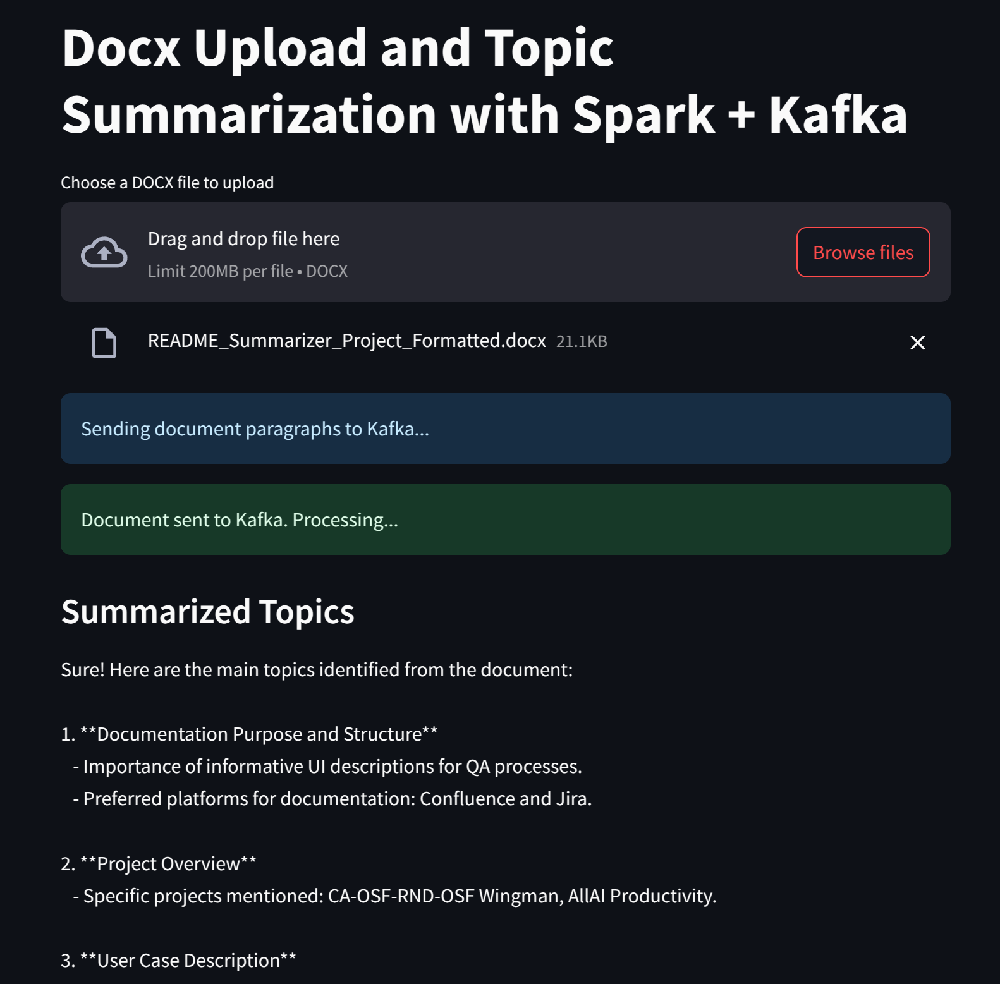

# 📝 Real-Time DOCX Topic Summarization with Streamlit, Kafka, Spark & OpenAI

This project demonstrates a real-time document processing pipeline using:

- **Streamlit** for the frontend
- **Kafka** for streaming text chunks
- **Spark Structured Streaming** for processing
- **OpenAI GPT API** for summarizing
- **SQLite** as a shared database for storing the summary

📁 Users upload `.docx` files via a web interface, and the app streams paragraph chunks to Kafka. Spark reads the stream, summarizes the content using OpenAI, and writes the result to a SQLite file. Streamlit monitors this file and displays the summary when ready.



---

## 📦 Architecture Overview

```
[Streamlit Upload]
       │
       ▼
[Kafka Broker] ◀────── [Streamlit sends .docx paragraphs]
       │
       ▼
[Spark Streaming Job]
       │
       ▼
[OpenAI GPT API]
       │
       ▼
[SQLite Shared DB]
       │
       ▼
[Streamlit reads summary and displays it]
```

---

## 🚀 Getting Started

### 1. Clone the Repository

```bash
git clone https://github.com/joaovbsever/spark-docx-summarizer.git
cd spark-docx-summarizer
```

### 2. Set Your OpenAI API Key

Create a `.env` file in the root:

```env
OPENAI_API_KEY=your_openai_api_key_here
```

> Don't have one? Get it at [https://platform.openai.com](https://platform.openai.com)

### 3. Build and Run the System

```bash
docker compose up --build
```

This starts:

- Kafka + Zookeeper
- Spark Master + Worker
- Streamlit app
- A shared volume for SQLite

Once you have your services running you can spin up the Spark job to listen for new file uploads

```bash
./scripts/job.sh
```

> Make sure the spark-master container name is correct, it might change in your configuration. To verify, run `docker ps` and look for the spark-master container name to use in the script.

---

## 💠 Directory Structure

```
.
├── app/                      # Streamlit frontend
│   ├── app.py
│   ├── Dockerfile
│   └── requirements.txt
├── spark/                    # Spark job
│   ├── worker.py
│   ├── requirements.txt
│   └── Dockerfile
├── spark/                    # Script to run Spark job
│   └── job.sh
├── .env                      # OpenAI key
├── compose.yml
└── README.md
```

---

## 🌐 Using the App

1. Visit: [http://localhost:8501](http://localhost:8501)
2. Upload a `.docx` file with meaningful paragraphs.
3. The app sends content to Kafka and shows a loading spinner.
4. Spark processes and summarizes the content via OpenAI.
5. The summary appears when available.

---

## 🖼️ Example


---

## 🧠 Tech Stack

| Component     | Purpose                                |
| ------------- | -------------------------------------- |
| **Streamlit** | User uploads and views summary         |
| **Kafka**     | Streams document content               |
| **Spark**     | Processes text and generates summary   |
| **OpenAI**    | Extracts topics from full document     |
| **SQLite**    | Stores summary shared between services |

---

## ⚙️ Troubleshooting

- 💔 **"Permission denied" writing SQLite?**  
  Make sure `/tmp/shared` is used and has proper permissions. The Spark Dockerfile handles this.

- 🌀 **Stuck in loading loop?**  
  Spark summary may be delayed; the app waits for a result for up to 2 minutes.

- 🧪 **Test it offline?**  
  You can mock the OpenAI API or replace it with local logic during development.

---

## 🧼 Cleaning Up

To stop and remove containers/volumes:

```bash
docker compose down -v
```
